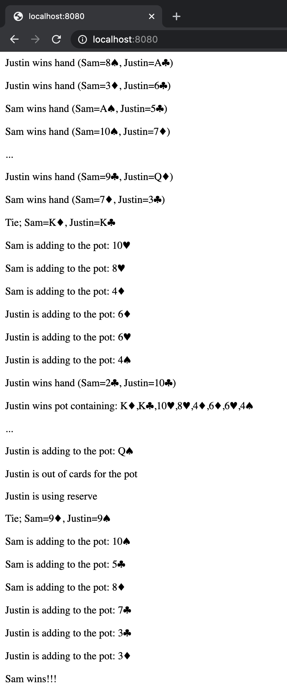

<!-- omit in toc -->
# jroman00/war-game

This is a simple web application that simulates a hand of [War (the card game)](https://en.wikipedia.org/wiki/War_\(card_game\)) with each page refresh

<!-- omit in toc -->
## Summary

- [Screenshot](#screenshot)
- [Getting Started](#getting-started)
  - [Prerequisites](#prerequisites)
  - [Initialize](#initialize)
  - [Stop](#stop)
  - [Run](#run)
- [Debugging](#debugging)
  - [Shell](#shell)
  - [Logs](#logs)
  - [Linting](#linting)
- [Contributing](#contributing)

## Screenshot

<details>
  <summary>Click to expand!</summary>

  
</details>

## Getting Started

These instructions will get you a copy of the project up and running on your local machine for development and testing purposes

### Prerequisites

The following packages are required:

| Package Name | URL | Minimum Required Version |
| ------------ | --- | ------------------------ |
| Docker | https://www.docker.com/ | latest |
| Docker Compose | https://docs.docker.com/compose/ | latest |

### Initialize

To initialize and start the application:

```bash
make init
```

To see it in action, point your browser to http://localhost:8080

### Stop

To stop the application:

```bash
make stop
```

### Run

To start the application:

```bash
make run
```

## Debugging

### Shell

To connect to a new container instance:

```bash
make shell
```

### Logs

To tail container logs:

```bash
make log
```

### Linting

To run the linter:

```bash
make lint
```

To run the lint-fixer:

```bash
make lint-fix
```

## Contributing

When contributing to this repository, please first discuss the change you wish to make via an issue, an email, or any other method with the owners of this repository before making a change

Please read [CONTRIBUTING.md](./CONTRIBUTING.md) and [CODE_OF_CONDUCT.md](./CODE_OF_CONDUCT.md) for more details
